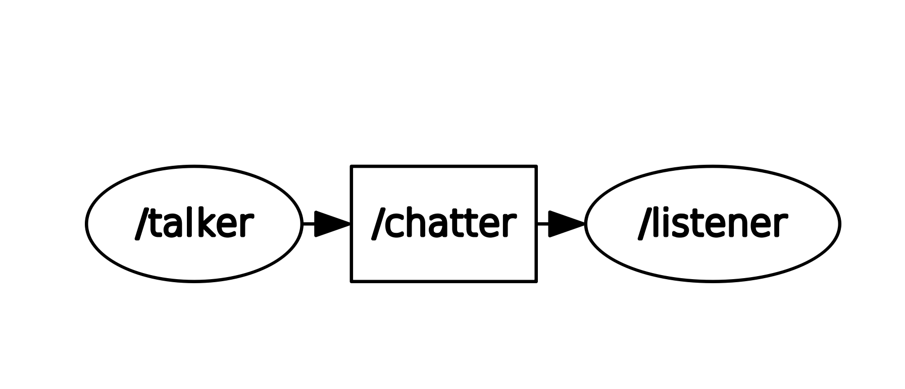

# beginner_tutorials
[](https://opensource.org/licenses/BSD-3-Clause)
---

## Overview

This repository contains a simple publisher and subscriber node.

The tutorials were followed from:[website](http://wiki.ros.org/ROS/Tutorials).

A launch file ```beginner_tutorials_10.launch``` can be used to launch talker and listener nodes concurrently.


A service message named ```TalkerService.srv``` is used to change the output string upon the request from the client


<p align="center">
<a target="_blank">
</a>
</p>


## Purpose

###### Main Features

The beginner_tutorials project builds a simple publisher and subscriber node.
talker is the publisher node which publishes the msg of data type std_msgs::string.
listener is subscriber node, which subscribe to the topic chatter.

## License

BSD 3-Clause License

Copyright (c) 2018, Saurav
All rights reserved.

Redistribution and use in source and binary forms, with or without
modification, are permitted provided that the following conditions are met:

* Redistributions of source code must retain the above copyright notice, this
  list of conditions and the following disclaimer.

* Redistributions in binary form must reproduce the above copyright notice,
  this list of conditions and the following disclaimer in the documentation
  and/or other materials provided with the distribution.

* Neither the name of the copyright holder nor the names of its
  contributors may be used to endorse or promote products derived from
  this software without specific prior written permission.

THIS SOFTWARE IS PROVIDED BY THE COPYRIGHT HOLDERS AND CONTRIBUTORS "AS IS"
AND ANY EXPRESS OR IMPLIED WARRANTIES, INCLUDING, BUT NOT LIMITED TO, THE
IMPLIED WARRANTIES OF MERCHANTABILITY AND FITNESS FOR A PARTICULAR PURPOSE ARE
DISCLAIMED. IN NO EVENT SHALL THE COPYRIGHT HOLDER OR CONTRIBUTORS BE LIABLE
FOR ANY DIRECT, INDIRECT, INCIDENTAL, SPECIAL, EXEMPLARY, OR CONSEQUENTIAL
DAMAGES (INCLUDING, BUT NOT LIMITED TO, PROCUREMENT OF SUBSTITUTE GOODS OR
SERVICES; LOSS OF USE, DATA, OR PROFITS; OR BUSINESS INTERRUPTION) HOWEVER
CAUSED AND ON ANY THEORY OF LIABILITY, WHETHER IN CONTRACT, STRICT LIABILITY,
OR TORT (INCLUDING NEGLIGENCE OR OTHERWISE) ARISING IN ANY WAY OUT OF THE USE
OF THIS SOFTWARE, EVEN IF ADVISED OF THE POSSIBILITY OF SUCH DAMAGE.

## Assumptions
- ROS Kinetic is installed properly.
- ROS environment is properly configured.
- Dependencies are met


## Dependencies
- ROS Kinetic
- catkin
- roscpp package
- rospy pacakges
- std_msgs package
- genmsg package

## Standard build via command-line
```
cd <path to workspace>
mkdir src
cd src
git clone -b Week11_HW --single-branch https://github.com/sauravkdeo/beginner_tutorials.git
cd ..
catkin_make
```
## Steps to run the package

### Sourcing to .bashrc
- open the .bashrc file located in the home folder using your favorite editor.Add the undermentioned lines at the end of the file and then save it.
- This step is done to avoid sourcing  ~/```path to workspace```/devel/setup.bash every time.
```
source ~/<path to workspace>/devel/setup.bash
ex:
source ~/catkin_ws/devel/setup.bash
```


### Using rosrun

######  Open three terminals concurrently :

- Run following commands in Terminal 1 :
```
roscore
```

- Run following commands to execute talker node in Terminal 2. A frequency value can be passed  :
```
rosrun beginner_tutorials talker <frequency>
```

- Run following commands to execute listener node in Terminal 3 :
```
rosrun beginner_tutorials listener
```

### Using roslaunch

- To use the launch file type the undermentioned command in the terminal :
```
roslaunch beginner_tutorials_10.launch
```
User can also change the frequency at which the loop operates using undermentioned command :
```
roslaunch beginner_tutorials_10.launch frequency:=<desired frequency>
ex:
roslaunch beginner_tutorials_10.launch frequency:=10
```


### Service

- User can also change the output string message by typing the following command in a new terminal
```
rosservice call /TextService "<text to be entered by the user>"
ex:
rosservice call /TextService "Hello ROS!!!"
```

### Logging

- Logger messages can seen once the talker and listener nodes are launched in the rqt_console GUI by running the following command.
```
rosrun rqt_console rqt_console
```

### Inspecting TF frames

- The talker node broadcasts tf transforms to `\talk` relative to the `\world` frame. While roscore and talker are running we can use `tf_echo` to print the tf transforms.
```
rosrun tf tf_echo /world /talk
```

- A pdf connecting the reference frame to the other frame can be generated and viewed by running the following commands.
The pdf will be generated at the location from where the command is run.
```
cd <path to repository>/results
rosrun tf view_frames
evince frames.pdf

```

### Visualizing TF frames
- Relative motion of the moving frame with respect to world frame can be visualized using rviz GUI using undermentioned command.Ensure that ensure that the roscore and listener nodes are already running
```
rosrun rviz rviz
```
Change the value of the Fixed Frame in the GUI from ```map``` to ```world```
click on the ```Add``` button and select ```TF```

You will be able to see a frame moving is circular motion.
### Running rostest

- The unit tests have been written using gtest and rostest. The unit tests can be run by the following commands
```
cd <path to catkin workspace>
catkin_make run_tests_beginner_tutorials
```

- You can test using:
```
rostest beginner_tutorials talkerTest.launch
```

### Recording bag files with the launch file

- You must first build the project using catkin_make as described earlier. You may run the command below to launch the nodes and record all the topics. The bag file will be in the  directory once the recording is complete.To enable rosbag recording, the user has to explicitly mention ```record:=true``` , else rosbag recording will be disabled by default.
```
roslaunch beginner_tutorials beginner_tutorials_10.launch record:=true
```

### Inspecting the bag file

- ```rqt_bag``` is a GUI tool to inspect,view and publish the bag files.
```
cd <path to repository>/results
rqt_bag listener.bag
```

### Playing back the bag file with the Listener node demonstration

- To replay the topic messages from the  bag file, ensure that the roscore and listener nodes are running. Then in a new terminal, enter the following command.
```
cd <path to repository>/results
rosbag play listener.bag
```

### Disabling bag files with the launch file

```
roslaunch beginner_tutorials beginner_tutorials_10.launch
```
